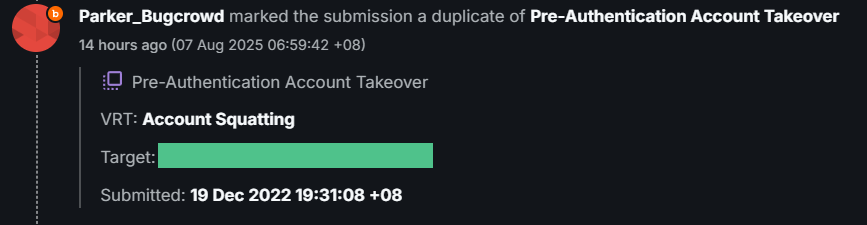

## Introduction

This is my first writeup and I'm planning to document the security vulnerabilities I've found while bug bounty hunting. I never really cared about building a public profile but lately, I've come to see the value in sharing what I find. The bug bounty community is more fun when ideas are shared, help each other spot edge cases and just work together over interesting bugs. So this article is me putting something back into the public space.

---

## Dive in

The target application is a communication platform that provides APIs and SDKs for integrating real-time chat, voice, and video into apps. It enables businesses to build engaging customer experiences with features like in-app messaging, notifications, and AI-powered agents, trusted by companies like DoorDash and Hinge for scalability and security. Think of it as Whatsapp but mainly for businesses.

Now, let's go ahead and talk about this bug that I found in one of the public programs listed in Bugcrowd. Due to the program's non-disclosure policy, I will be using `redacted.com` as the vulnerable target.

While poking around `dashboard.redacted.com`, I found a classic Pre-Account Takeover (Pre-ATO) bug but with a twist. Due to a combination of OAuth misconfiguration and missing CSRF protection on the login endpoint, it’s possible for an attacker to silently share access to a victim’s account without them ever realizing, potentially exposing sensitive data such as billing information, PII, or API tokens.

---

### Vulnerability chain components

1. OAuth misconfiguration
   - Let's say someone registers `user@example.com` using the OAuth method (like Google). Later, if someone tries to register the same email using the email/password method, they'll get an error saying `Email is already in used", which is expected.
   - But the other way around doesn't work the same. If `user@example.com` was first registered using email/password method, and the legitimate user later tries to sign up with the OAuth method, the application allows it without checking for account ownership. No error, no warning. This means both the email/password login and OAuth login now point to the same account, even though they came from two different sources.
2. Lack of CSRF protection on the login endpoint `//api.redacted.com/dashboard/auth/authenticate`
   - For account verification to happen successfully after user registration, the user verifying it needs to have a valid user session, and it doesn't matter if the user session does not correspond to the verification token `//dashboard.redacted.com/verify-email/4a7b3c2d-9e1f-4b8a-a3d5-6f7e8c9a0b1d`
   - Due to the lack of CSRF protection in the mentioned login endpoint, attacker can use this gadget to force the victim into getting a valid user session (using attacker's credential) in order to verify the victim account successfully.

---

## Here's the flow

The attacker registers using the victim's email first (via email/password method). Later, when the victim tries to register via OAuth (like Google), the application allows it without warning that the email is already claimed by another user on the application. To finalize the account registration (verification), a valid user session is required. That's where the CSRF comes in. The attacker tricks the victim into logging in as them (using attacker's credentials), allowing the verification to succeed. Now both attacker and victim share access to the same account and the victim has no idea.

### Reproduction steps

1. As attacker, register victim@gmail.com via email/password at dashboard.redacted.com
2. On the “Create Organization” step, click logout, this helps make the compromise less obvious
3. As victim, register to dashboard.redacted.com using Google OAuth with victim@gmail.com
4. Victim gets an error but also receives a verification email
5. Victim needs a valid session to use the verification link
6. Attacker sends this CSRF payload to the victim to get that valid user session:

```html
// csrf-poc.html

<html>
  <body>
    <form action="https://api.redacted.com/dashboard/auth/authenticate/" method="POST" enctype="application/json">
      <input type="hidden" name="email" value="attacker@gmail.com">
      <input type="hidden" name="password" value="Attackerpassword123#">
    </form>
    <script>
      document.forms[0].submit();
    </script>
  </body>
</html>
```

7. Victim clicks the verification link, now both attacker and victim share access to the same account

---

## Impact

- Pre-Account Takeover: attacker claims email before real user signs up
- No ownership verification when signing up via OAuth
- Victim and attacker silently share the same account
- Sensitive data like billing info, API tokens, or PII could be accessed
- Victim is completely unaware that their account is compromised

---

## How to fix

- Clear existing sessions when login method changes (e.g. email/password to OAuth)
- Always verify ownership of email before activating any account
- If an account with that email already exists, prompt for confirmation or previous credentials
- Add CSRF protection to login endpoints

---

After a few days waiting for update from the triage team, unfortunately, another user had submitted the report which means my submission was marked as a duplicate.


